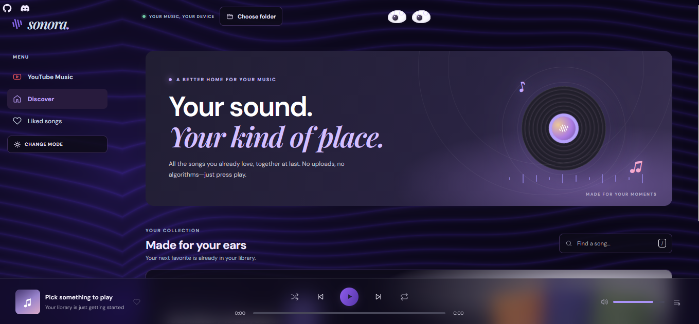
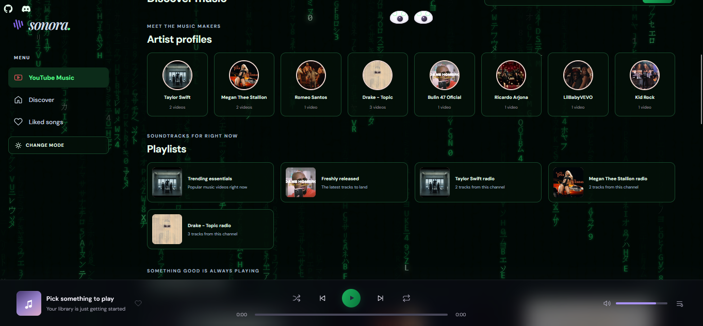

# Sonora

Sonora is a music player for the songs on your device, with a customizable listening space and a YouTube Music discovery page.

## Preview

### Your music, your space



### Discover music



Discovery results and thumbnails change over time and can vary by region.

## Features

- **Play your own music:** Choose a music folder or select audio files. Supported file types include MP3, WAV, OGG, M4A, AAC, FLAC, OPUS, and WMA; playback depends on browser codec support.
- **Manage listening:** Search your library, like tracks, and use shuffle, repeat, volume, and playback controls.
- **Make it yours:** Choose from eight themes in the theme studio: Lines Talks, DOT ME, Moss Garden, Golden Hour, Rose Radio, After Hours, Soft Focus, and MATRIX. The selected theme is saved in your browser.
- **Discover on YouTube Music:** Browse trending music videos, search for artists or songs, and view artist/channel collections and generated playlists.
- **Keep local music local:** Sonora plays files selected in your browser; it does not upload them.

## Run locally

Sonora uses Python's standard library and does not require installing Python packages.

1. Install Python 3 if it is not already available.
2. Open PowerShell in the Sonora project folder.
3. Start the local server:

   ```powershell
   python server.py
   ```

   If `python` is not recognized on Windows, try:

   ```powershell
   py -3 server.py
   ```

4. Open <http://127.0.0.1:8000> in your browser.
5. Choose **Choose folder** to load music from your device, or select individual audio files if folder selection is unavailable in your browser.

Keep the server terminal open while using Sonora. Do not open `index.html` directly: the YouTube discovery API requires the local server.

## Set up YouTube Music discovery

Local music playback does not require an API key. To enable YouTube discovery:

1. Create a Google API key in Google Cloud Console.
2. Enable **YouTube Data API v3** for the associated project.
3. Create a `.env` file in the project folder with:

   ```text
   YOUTUBE_API_KEY=your_api_key_here
   ```

4. Restart `python server.py`, then reload Sonora.

The local server reads the key from `.env` and makes YouTube API requests; the key is not sent to the browser. `.env` is excluded by `.gitignore`—keep the key private and do not commit it. Restrict the key to the YouTube Data API v3 in Google Cloud Console.

## YouTube playback and limitations

- Sonora uses the YouTube Data API to find public music videos. Results can vary by region, availability, and API quota.
- Artist/channel cards and playlists are built from the videos returned by discovery; Sonora does not connect to a personal YouTube Music account or import its private playlists.
- Selecting a video opens its corresponding page on **YouTube Music** in a new browser tab. Sonora does not play YouTube audio inside the website.
- YouTube controls playback and any ads, sign-in requirements, or availability restrictions. Sonora cannot provide ad-free YouTube playback. Allow pop-ups for the local Sonora page if the new tab does not open.

## Project files

| File or folder | Purpose |
| --- | --- |
| `index.html` | App layout and controls |
| `styles.css` | Responsive styling, theme studio, and visual effects |
| `app.js` | Local audio playback, library interactions, themes, and YouTube discovery UI |
| `server.py` | Local web server and YouTube Data API proxy |
| `screenshots/` | README preview images |

